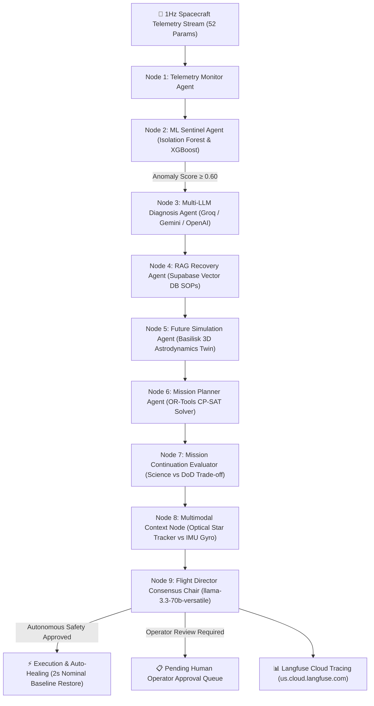

# 🛰️ SMOA: Autonomous Space Satellite Mission Operations & 3D Digital Twin System

> **CodeRush 2.0 Hackathon Entry** · *Autonomous Multi-Agent Satellite Operations, Fault Isolation, Basilisk Astrodynamics Digital Twin & Langfuse Observability*

---

## 🌟 Executive Summary

**SMOA (Space Mission Operations Automator)** is a production-grade, multi-agent AI mission control architecture designed for autonomous satellite fleet monitoring, predictive fault isolation, 3D Digital Twin simulation, and automated anomaly self-healing.

Powered by a **9-Agent LangGraph Pipeline**, **Basilisk (BSK) Astrodynamics Simulator**, **Supabase Vector RAG SOP Retrieval**, **Google OR-Tools CP-SAT Solver**, and **Langfuse Cloud Tracing**, SMOA converts raw 52-parameter 1Hz spacecraft telemetry streams into real-time consensus decisions, 30-minute predictive trajectory validations, and autonomous recovery execution without human intervention.

---

## 🏗️ System Architecture & 9-Agent Workflow



### 🤖 9-Agent Node Roles & Responsibilities

| Node ID | Agent Name | Core Subsystem & Technology | Responsibilities |
|---|---|---|---|
| **Node 1** | **Telemetry Monitor Agent** | 52-Param Ingestion Engine | Audits 52 1Hz state vector parameters against certified 3σ variance envelopes. |
| **Node 2** | **ML Sentinel Agent** | Isolation Forest & XGBoost | Evaluates multivariate anomaly scores ($0.00 \rightarrow 1.00$). Triggers diagnosis if score $\ge 0.60$. |
| **Node 3** | **Diagnosis Agent** | Groq / Gemini / OpenAI Parallel LLMs | Runs parallel LLM provider prompts to pinpoint root causes & competing hypotheses. |
| **Node 4** | **RAG Recovery Agent** | Supabase Vector Database | Queries pgvector knowledge base for contingency Standard Operating Procedures (SOPs). |
| **Node 5** | **Future Simulation Agent** | Basilisk (BSK) Astrodynamics Engine | Runs 30-minute predictive rigid body kinematics & EPS power node equations ($T+00\text{m} \rightarrow T+30\text{m}$). |
| **Node 6** | **Mission Planner Agent** | Google OR-Tools CP-SAT Solver | Solves schedule precedence, power budget surplus, and downlink window constraints. |
| **Node 7** | **Mission Continuation Node** | Mission Resilience Evaluator | Calculates science throughput vs battery Depth-of-Discharge (DoD) trade-off bounds. |
| **Node 8** | **Multimodal Context Node** | Cross-Sensor Audit | Cross-verifies optical star tracker pointing vectors against IMU gyro body rates. |
| **Node 9** | **Flight Director Consensus Chair** | llama-3.3-70b-versatile | Synthesizes votes from 8 child nodes into final flight recommendation & trust score (/100). |

---

## ⚡ Autonomous AI Self-Healing Anomalies (Zero Human Intervention)

SMOA features 3 deterministic autonomous recovery profiles that self-heal satellite systems with **0% human intervention**:

1. **`reaction_wheel_desat` (ADCS Reaction Wheel Momentum Saturation)**:
   - **Trigger**: Reaction wheel 3 angular velocity reaches $5,200\text{ RPM}$ ($1.45\text{ Nms}$ stored momentum).
   - **AI Recovery**: Automatically fires B-field magnetorquer coils (`ADCS_AUTONOMOUS_MAGNETORQUER_DESAT`), dumps excess momentum, and restores nominal baseline in 2.0s.
   - **Severity**: `LOW`

2. **`ssr_buffer_flush` (Solid-State Recorder Storage Capacity Alert)**:
   - **Trigger**: Solid-State Data Recorder memory reaches $92\%$ capacity ($44.1\text{ GB} / 48\text{ GB}$).
   - **AI Recovery**: Automatically compresses telemetry log archives (`SSR_AUTONOMOUS_COMPRESS_AND_FLUSH`), releasing $12.4\text{ GB}$ storage.
   - **Severity**: `LOW`

3. **`payload_heater_cycle` (Payload Camera Cold Excursion)**:
   - **Trigger**: Payload camera optical sensor temperature drops to $-5.2^\circ\text{C}$ in orbital shadow.
   - **AI Recovery**: Automatically cycles payload zone-1 operational heater (`THERMAL_AUTONOMOUS_ZONE_HEATER_ON`) for 180s.
   - **Severity**: `LOW`

---

## 🌐 Microservice Port Mappings & Services

| Service Name | Technology Stack | Port | Endpoint URL | Description |
|---|---|---|---|---|
| **FastAPI Core Backend** | Python 3.11, FastAPI, Uvicorn | `8000` | `http://localhost:8000` | REST API, WebSocket streams, LangGraph & OR-Tools |
| **SMOA Control Console** | TanStack Start, React 19, Three.js, Tailwind v4 | `5173` | `http://localhost:5173` | Main Flight Control Dashboard & 3D Digital Twin Viewer |
| **Seeding Controller UI** | Vite, React 19, Tailwind v4 | `5174` | `http://localhost:5174` | Anomaly Injection & Live Telemetry Parameter Offsets |
| **3D Constellation Service** | Python, FastAPI, WebSockets | `8001` | `http://localhost:8001` | Multi-Satellite Constellation Orbit Tracker |

---

## 🚀 Quickstart & Setup Guide

### 1. Prerequisites
- **Python**: 3.10 or higher
- **Node.js**: v18 or higher (`npm`)

### 2. Single-Command Launcher (Clean Boot)
Run the automated multi-process orchestrator from the project root:

```bash
python start_all.py
```

This single command automatically:
1. Validates Python & Node.js environment dependencies.
2. Starts the **FastAPI Backend** on `http://localhost:8000`.
3. Starts the **3D Constellation Tracker** on `http://localhost:8001`.
4. Starts the **Data Seeding Controller** on `http://localhost:5174`.
5. Starts the **SMOA Main Control Console** on `http://localhost:5173`.

---

## 📡 API Endpoints Quick Reference

### Core Telemetry & Anomaly Triggering
- `GET /health` — Returns system health status and registered model counts.
- `POST /api/seeding/anomaly` — Triggers simulated spacecraft anomaly mode (`power_droop`, `adcs_oscillation`, `reaction_wheel_desat`, `ssr_buffer_flush`, `payload_heater_cycle`, etc.).
- `POST /api/digital-twin/simulate` — Runs 30-minute predictive Basilisk astrodynamics trajectory preview.
- `GET /api/planner/schedules` — Retrieves dynamic mission activity schedules (enforces **Max 9 Active Tasks Rule** with 1-hour auto-pruning).
- `GET /api/events` — Returns reverse chronological list of anomaly events and rich LLM diagnoses.
- `GET /api/commands/pending` — Returns holding queue of pending flight commands awaiting authorization.

---

## 🧪 Testing Discipline

Run the automated Pytest test suite from the project root:

```bash
pytest backend/tests/test_full_suite.py -v
```

Run the frontend compilation check:

```bash
cd frontend && npm run build
```

---

## 📄 License & Attribution

Developed for the **CodeRush 2.0 Hackathon**. Built with FastAPI, LangGraph, Basilisk Digital Twin, Supabase, TanStack Start, React 19, Three.js, and Langfuse Cloud.
