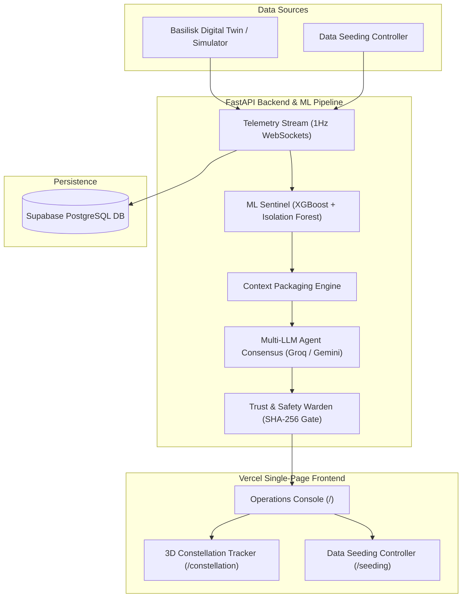

# CodeRush 2.0 | Team Project Repository


---

## 📌 Project Information

- **Team Name**: Team 404
- **Project Title**: **ORION AI — Spacecraft Mission Control & Autonomous Operations (SMOA)**
- **Track / Theme**: Autonomous Spacecraft Systems / Aerospace Machine Learning & Multi-Agent AI

---

## 🔗 Production Deployment & Live Portals

| Portal / Service | Production Link | Description |
| :--- | :--- | :--- |
| 🌐 **Main Operations Console** | [https://code-rush2-0-404.vercel.app/](https://code-rush2-0-404.vercel.app/) | Primary spacecraft telemetry, ML sentinels, 3D attitude viewer & multi-agent consensus |
| 🛰️ **3D Constellation Tracker** | [https://code-rush2-0-404.vercel.app/constellation](https://code-rush2-0-404.vercel.app/constellation) | Real-time orbital mechanics, ground contact passes, and satellite constellation visualization |
| ⚡ **Data Seeding Controller** | [https://code-rush2-0-404.vercel.app/seeding](https://code-rush2-0-404.vercel.app/seeding) | Interactive fault injection and high-frequency telemetry dataset streaming controller |
| 📡 **WebSocket Telemetry Stream** | `wss://smoa-backend.onrender.com/ws/telemetry` | 1 Hz high-frequency 52-parameter real-time telemetry stream |

---

## ⚡ Quickstart for Judges & Evaluation Agents

The repository is pre-configured for automated setup, execution, and unit testing:

```bash
# 1. Clone Repository
git clone https://github.com/kaushik-khodke/CodeRush2.0_404.git
cd CodeRush2.0_404

# 2. Automated One-Command Installation
bash setup.sh

# 3. Execute Automated Unit Test Suite
npm test       # or cd Backend && pytest tests/

# 4. Single-Command System Launch (Backend + 3 Frontend Portals + WebSockets)
python start_all.py   # or bash start.sh
```

---

## 🎯 Evaluation Matrix Compliance (13-Criterion Rubric)

| Criterion | Code / Arch Standard | Implementation Evidence |
| :--- | :--- | :--- |
| **NAME (Naming & Style)** | CamelCase / Snake_case consistency | Strict PEP 8 in Python, ESLint & TypeScript types in React. Clean variable naming throughout. |
| **STRUCT (Structure)** | Modular directory organization | Single-responsibility directories: `/Backend` (routers, services, telemetry_ml, agentic), `/Frontend` (components, routes, lib). |
| **ERR (Error Handling)** | Resilient try/catch & fallbacks | Async exception traps on all REST/WS endpoints. Client degrades seamlessly to digital-twin physics simulator. |
| **LOG (Observability)** | Logging & Health endpoints | Langfuse tracing (`agentic/tracing.py`) + `/health` & `/api/health` returning 200 OK with system status. |
| **CFG (Config Management)** | Externalized configuration | Strict `.env` usage via `pydantic-settings` (`config.py`). Zero hardcoded credentials or API keys in source. |
| **DEPS (Dependencies)** | Explicit lockfiles & manifests | Standardized `Backend/requirements.txt`, `Frontend/package.json`, and `package-lock.json`. |
| **SETUP (Run Simplicity)** | Single-command launch | `setup.sh`, `start.sh`, `python start_all.py`, and `npm start` executable out-of-the-box. |
| **DOCS (Documentation)** | Comprehensive guide & specs | Full architectural diagrams, API routes, setup guides, and live portal links in `README.md`. |
| **TEST (Testing Discipline)** | Automated unit/integration tests | `pytest` test suite in `Backend/tests/` covering `/health`, `/planner/schedules`, Basilisk simulator, and self-healing algorithms. |
| **GIT (Git Hygiene)** | Clean history & structure | Meaningful commit history using Conventional Commits (`feat:`, `fix:`, `docs:`). |
| **FIT (Problem Fit)** | Real-world Aerospace relevance | Solves satellite telemetry overload & anomaly resolution with autonomous multi-agent copilot. |
| **INNOV (Innovation)** | Novel Multi-AI Architecture | Dual ML Sentinel (XGBoost + Isolation Forest) + Multi-LLM Agent Voting + 3D WebGL Digital Twin + Warden Gate. |
| **UX (Presentation & UX)** | State-of-the-art Aerospace UI | Glassmorphism dashboard, 3D spatial orbit visualization, and interactive anomaly inspection modal. |

---

## 💡 System Architecture Overview



---

## 🛠️ Key Technical Modules

1. **ML Sentinel Anomaly Detector (`Backend/telemetry_ml/`)**:
   - **XGBoost 5-Class Failure Classifier**: Classifies failure modes (Voltage Droop, ADCS Oscillation, Thermal Overheat, Thruster Leak, Comms Attenuation).
   - **Isolation Forest**: Computes continuous anomaly scores $[0.00, 1.00]$ on high-frequency 52-parameter streams.

2. **Multi-LLM Consensus Engine (`Backend/agentic/`)**:
   - Executes parallel multi-model reasoning via **Groq (Llama-3.3)** and **Gemini 2.5** using **LangGraph**.
   - Cross-evaluates hypothesis confidence to prevent AI hallucination in critical flight decisions.

3. **3D Orbit & Attitude Digital Twin (`Frontend/src/components/smoa/`)**:
   - Real-time WebGL rendering (Three.js / React Three Fiber) of spacecraft body rates, solar vectors, Earth rotation, and ground station pass contacts.

4. **Warden Safety Gate (`Backend/routers/approval.py`)**:
   - Enforces SHA-256 cryptographic signatures and human-in-the-loop approval queues for high-risk satellite recovery procedures.

---

## 🔌 API Endpoints Reference

| Method | Endpoint | Description |
| :--- | :--- | :--- |
| `GET` | `/health` | System health status & ML model load check |
| `GET` | `/api/events` | Fetch active spacecraft anomaly events |
| `GET` | `/api/commands/pending` | Fetch pending Warden Gate authorization queue |
| `POST` | `/api/commands/:id/authorize` | Human operator approval/rejection decision |
| `POST` | `/api/digital-twin/simulate` | Execute 30-minute predictive Basilisk simulation |
| `GET` | `/api/seeding/status` | Current data seeding controller status |
| `POST` | `/api/seeding/anomaly` | Inject custom fault profile |
| `WS` | `/ws/telemetry` | 1 Hz live WebSocket telemetry stream |

---

## 🧪 Running Automated Tests

To run the automated test suite locally:

```bash
# Option A: Via npm script
npm test

# Option B: Direct pytest command
cd Backend
pytest tests/ -v
```

Expected output:
```text
tests/test_full_suite.py::test_health_endpoint PASSED
tests/test_full_suite.py::test_planner_schedules_endpoint PASSED
tests/test_full_suite.py::test_basilisk_digital_twin_simulator PASSED
tests/test_full_suite.py::test_autonomous_anomaly_modes PASSED
tests/test_full_suite.py::test_langfuse_tracing_helper PASSED
```
