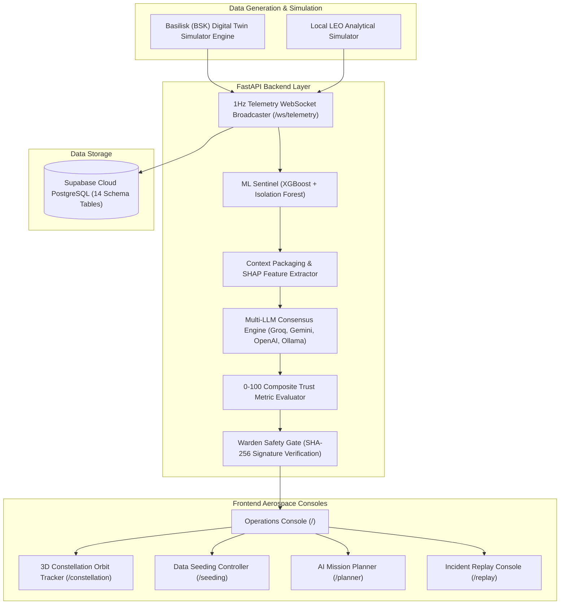

# System Architecture Overview — SMOA / ORION AI

## Executive Summary
**SMOA (Space Mission Operations Automator)** is an autonomous satellite operations platform designed to eliminate telemetry monitoring fatigue and accelerate critical orbital incident resolution.

## Component Decomposition

## System Layers
1. **Telemetry Stream Layer**: 52 real-time parameters broadcast at 1Hz over WebSockets.
2. **ML Sentinel Anomaly Layer**: Dual-model system (XGBoost 5-Class Classifier + Isolation Forest continuous scorer).
3. **Multi-Agent Consensus Layer**: LangChain/LangGraph workflow coordinating parallel Groq, Gemini, OpenAI, and Ollama reasoning.
4. **Safety & Trust Gate**: Enforces physical parameter boundary checks and human-in-the-loop approval queues.
5. **Presentation Layer**: Responsive React 19 + Three.js aerospace glassmorphism interface.
